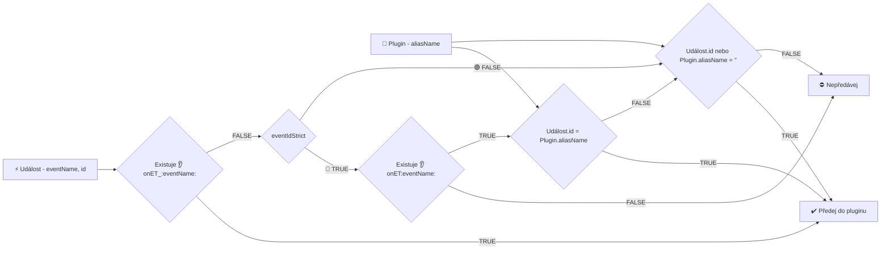

# ▼ Filtrování událostí v pluginech

V pluginech existuje přepínač na (de)aktivaci filtru na příjem událostí podle **aliasName (id)** instance pluginu:

```javascript
this.eventIdStrict = true;
```

Volání provádějte v konstruktoru nebo na začátku funkce init() nebo nejpozději před voláním base.init().

Filtrování událostí je dvoustupňové - podle eventIdStrict a jména obslužné funkce. V následujících podkapitolách je popsáno podrobněji.

## Úvodní souhrn

- Funkce **onET_(jméno události)** přijímá všechny události s eventName = (jméno události)
- Funkce **onET(jméno události)** přijímá všechny události s eventName = (jméno události) a id = plugin.aliasName
- **Plugin s plugin.aliasName = ''** přijímá všechny události do funkce **onET(jméno události)** nebo **onET_(jméno události)**

## Diagram rozhodovacího procesu



## 0. Význam hodnot aliasName (''/...)

| Hodnota aliasName | Popis |
|---|---|
| '' | (Inicializace **třída:** v seznamu pluginů). Pokud je nastavena tato hodnota, plugin je schopný přijímat většinu zpráv systému (jsou běžně posílány s nevyplněným id). |
| xxx | V případě jakkoli jinak vyplněné hodnoty o dalším zpracování rozhoduje vlastnost **eventIdStrict**. |

## 1. Význam hodnot eventIdStrict (🟢/🔺)

Obvyklá hodnota bývá **false**, aby plugin přijímal všechny události nezávisle na jejich id.

| Hodnota eventIdStrict | Popis |
|---|---|
| false | 🟢 Není filtrováno id příchozích událostí. Příchozí události se filtrují pouze obsluhami na pluginu, které se jmenují **onET_(jméno události)** nebo **onET(jméno události)** |
| true | 🔺 Požadována striktní shoda id v událostech. Tedy pokud **aliasName** (**id** pluginu) a **id** v události se shodují, pak je událost předána pluginu. Aby plugin událost zpracoval, musí mít navíc definovanou metodu obsluhy **onET_(jméno události)** nebo **onET(jméno události)** |

Pokud je zde **false** a plugin má **aliasName (id)** prázdné (inicializace **třída:**), pak událost **je předána** ke zpracování do dalšího kroku. V případě **false** také není rozhodující jméno obsluhy **ET vs. ET_**.

## 2. Jméno obslužné funkce (ET/ET_)

| Jméno události | Výsledek |
|---|---|
| **neexistuje žádná onET funkce v pluginu** | Událost není pluginu předána ke zpracování. |
| onET_(jméno události) | (onET podtržítko) Událost je pluginu předána ke zpracování **bez ohledu na shodu id události a pluginu**. ⚠️ **Jméno funkce s podtržítkem je nadřazeno nastavení eventIdStrict.** |
| onET(jméno události) | (onET) Událost je pluginu předána ke zpracování **pouze když id události a pluginu se shodují**. Nezadané id pluginu je také považováno za shodu. |

## Jak rozhodnout nastavení?

Plugin by neměl poslouchat všechny události, ale budou se zasílat jen některé přímo jemu, proto dostane konkrétní id a eventIdStrict = true.

EventIdStrict na **true** nastavte minimálně v těchto případech:

- Plugin bude (nebo může) běžet ve více než jedné instanci (například 📇 slovník klíčových slov a 🔎 fulltext hledání)
- Plugin bude součástí procesu (🖼️ [pTRPhasePlugin][pTRPhasePlugin] - vypisování obsahu kapitoly)
- Plugin bude součástí většího funkčního celku (🔹 [pIndexFile:fulltextList][pIndexFile] - dynamické vytvoření fulltext indexu nápovědy)

[pTRPhasePlugin]: pTRPhasePlugin.md "pTRPhasePlugin"
[pIndexFile]: :inst:pIndexFile:fulltextList.md "pIndexFile:fulltextList"
