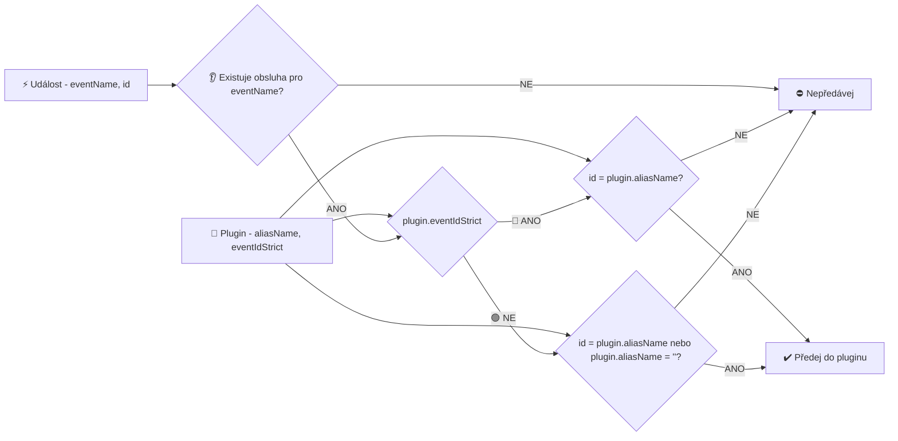

# 🔺 Filtrování událostí v pluginech - rozbor

## Diagram rozhodovacího procesu

## 0. Význam hodnot aliasName (''/...)

| aliasName | Popis |
|---|---|
| '' | (Inicializace **třída:** v seznamu pluginů). Pokud je nastavena tato hodnota, plugin je schopný přijímat většinu zpráv systému (jsou běžně posílány s nevyplněným id). |
| xxx | V případě jakkoli jinak vyplněné hodnoty o dalším zpracování rozhoduje vlastnost **eventIdStrict**. |

## 1. Význam hodnot eventIdStrict (🟢/🔺)

Obvyklá hodnota bývá **false**, aby plugin přijímal všechny události nezávisle na jejich id.

| eventIdStrict | Popis |
|---|---|
| false | 🟢 Není filtrováno id příchozích událostí. Příchozí události se filtrují pouze obsluhami na pluginu, které se jmenují **onET_(jméno události)** nebo **onET(jméno události)** |
| true | 🔺 Požadována striktní shoda id v událostech. Tedy pokud **aliasName** (**id** pluginu) a **id** v události se shodují, pak je událost předána pluginu. Aby plugin událost zpracoval, musí mít navíc definovanou metodu obsluhy **onET_(jméno události)** nebo **onET(jméno události)** |

Pokud je zde **false** a plugin má **aliasName (id)** prázdné (inicializace **třída:**), pak událost **je předána** ke zpracování do dalšího kroku. V případě **false** také není rozhodující jméno obsluhy **ET vs. ET_**.

## 2. Jméno obslužné funkce (ET/ET_)

| Jméno události | Výsledek |
|---|---|
| **neexistuje žádná onET funkce v pluginu** | Událost není pluginu předána ke zpracování. |
| onET_(jméno události) | (onET podtržítko) Událost je pluginu předána ke zpracování **bez ohledu na shodu id události a pluginu**. ⚠️ **Jméno funkce s podtržítkem je nadřazeno nastavení eventIdStrict.** |
| onET(jméno události) | (onET) Událost je pluginu předána ke zpracování **pouze když id události a pluginu se shodují**. Nezadané id pluginu je také považováno za shodu. |
