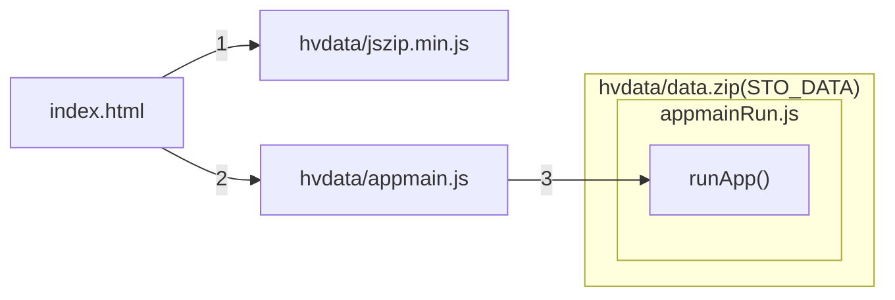

# ▶️ Spouštěcí sekvence

## Diagram

## Přehled fází spouštění

V dokumentaci se budou objevovat obecnější názvy popisů fází. Tyto pojmy budou zastupovat konkrétní širší sadu fází spouštění aplikace.

| Fáze | Kroky | Popis |
|---|:---:|---|
| Zavádění | 0-2 | 🗂️ Aplikační komponenty jsou k dispozici jako nekomprimované soubory uložené přímo ve složkách aplikace. |
| Data aplikace | 3-3.5 | 🗃️ Komponenty jsou načteny z archivu **hvdata/data.zip**. Alias **STO_DATA** (**:** v cestě kapitoly) umožňuje přístup k těmto datům v aplikaci. |
| Data nápovědy | 3.6-3.9 | 🗃️❔ Pokud existuje, načítá se další logika a data z nápovědy, částečně nahrazují standardní logiku. |
| Události a moduly | 3.10 | 🧩 Načítají se základní pluginy - zásuvné moduly, které obsahují aplikační komponenty. Od tohoto bodu dále je možno používat systém pluginů a událostí. |
| Rozšíření logiky | 3.11-3.13 | 🗃️❔➕ Aplikační logika je rozšířena o načtená data z nápovědy. |
| Spouštění | 3.14 | ⚡ Událost **PluginsLoadingFinished** potvrzuje dokončené spuštění aplikace. |

## Detail fází spouštění

| Fáze | Kroky | Popis |
|---|:---:|---|
| Zavádění | 0-2 | Základní sekvence zavádění aplikace. Komponenty jsou k dispozici jako nekomprimované soubory. |
| Zavedení dat aplikace | 3 | Soubor **hvdata/data.zip** je načten do paměti knihovnou **JSZIP**. Pokud tato operace selže (CORS omezení), na obrazovce uvidíte zprávu **⚠ Do you see this message only?**. |
| Zavedení dat aplikace 2 | 3.1-3.4 | Další aplikační data - kaskádové styly, layout UI - jsou načtena a připravena pro použití. |
| Načtení dat nápovědy | 3.5-3.9 | Data z nápovědy rozšiřují nebo nahrazují standardní logiku. Obsah je nepovinný, popsaný v samostatné kapitole. |
| Zavedení pluginů | 3.10 | V pořadí podle sekvence **STO_DATA:plugins.lst** jsou načteny do paměti, zavedeny a spuštěny instance uvedených pluginů - zásuvných modulů. |
| Spouštění | 3.11 | Hlavní aplikační logika je načtena do paměti a spuštěna. |
| Spouštění 2 | 3.12-3.14 | Data z nápovědy jsou aplikována a posílá se notifikační událost dokončení spuštění. Aplikace je připravena k práci. |

## Kroky spouštění

0. index.html
1. hvdata/jszip.min.js
2. hvdata/appmain.js
3. hvdata/data.zip (STO_DATA, repozitář : ./zip) : 
   1. appmainRun.js : runApp()
   2. css.lst
   3. layout.htm, main.css
   4. js.lst
   5. STO_DATA:appmainNext0.js
   6. STO_HELP:layout.htm (přepíše načtený soubor z bodu 3), main.css (zavede se jako rozšíření souboru z bodu 3)
   7. STO_HELP:appmainNext.js, STO_DATA:appmainNext.js (načtení jednoho z nich, STO_HELP má přednost, pokud existuje)
   8. STO_HELP:plus.css (načtení)
   9. STO_HELP:plus.js (načtení)
   10. STO_DATA:plugins.lst
   11. STO_?:appmainNext.js (zavedení)
   12. STO_HELP:plus.css (zavedení)
   13. STO_HELP:plus.js (zavedení)
   14. ⚡ PluginsLoadingFinished
