# 🔺 Filtering events in plugins details

## Decision process diagram

```mermaid
flowchart LR
  Event[⚡ Event - eventName, id] --> CheckHandler
  Plugin[🧩 Plugin - aliasName, eventIdStrict] --> CheckIdRelaxed
  Plugin --> CheckIdStrict
  Plugin --> CheckStrict
  CheckHandler{👂 Is there a handler for eventName?} -->|NO| EndN
  CheckHandler -->|YES| CheckStrict
  CheckStrict{plugin.eventIdStrict} -->|🔺 YES| CheckIdStrict
  CheckStrict -->|🟢 NO| CheckIdRelaxed
  CheckIdStrict{id = plugin.aliasName?} -->|YES| EndY
  CheckIdStrict -->|NO| EndN
  CheckIdRelaxed{id = plugin.aliasName or plugin.aliasName = ''?} -->|YES| EndY
  CheckIdRelaxed -->|NO| EndN
  EndY[✔️ Pass to plugin]
  EndN[⛔ Do not pass]
```

## 0. Meaning of aliasName values (''/...)

| aliasName | Description |
|---|---|
| '' | (Initialization **class:** in the plugin list). If this value is set, the plugin is able to receive most system messages (they are usually sent with an empty id). |
| xxx | If the value is filled in any other way, the **eventIdStrict** property determines further processing. |

## 1. Meaning of eventIdStrict values (🟢/🔺)

The usual value is **false**, so that the plugin accepts all events regardless of their ID.

| eventIdStrict | Description |
|---|---|
| false | 🟢 The IDs of incoming events are not filtered. Incoming events are filtered only by plugin handlers named **onET_(event name)** or **onET(event name)** |
| true | 🔺 Strict ID matching in events is required. That is, if **aliasName** (**id** of the plugin) and **id** in the event match, then the event is passed to the plugin. In order for the plugin to process the event, it must also have a defined handler method **onET_(event name)** or **onET(event name)** |

If **false** is present and the plugin has an empty **aliasName (id)** (initialization **class:**), then the event **is passed** to the next step for processing. In the case of **false**, the name of the handler **ET vs. ET_** is also not decisive.

## 2. Name of the handler function (ET/ET_)

| Event name | Result |
|---|---|
| **There is no onET function in the plugin** | The event is not passed to the plugin for processing. |
| onET_(event name) | (onET underscore) The event is passed to the plugin for processing **regardless of whether the event id and plugin id match**. ⚠️ **The name of the function with an underscore takes precedence over the eventIdStrict setting.** |
| onET(event name) | (onET) The event is passed to the plugin for processing **only if the event ID and plugin ID match**. An unspecified plugin ID is also considered a match. |
