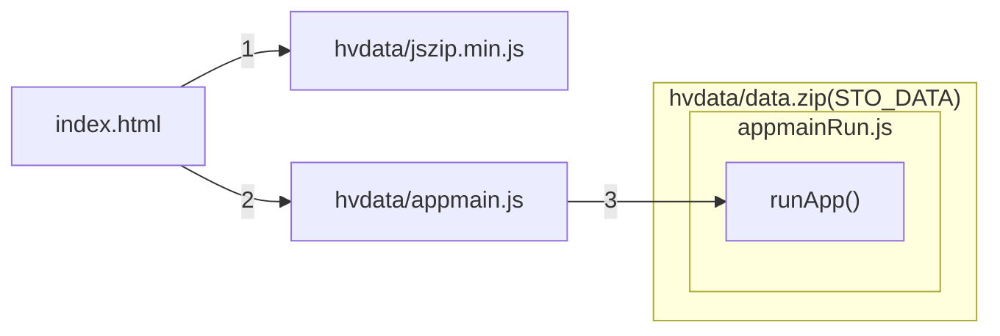

# ▶️ Startup sequence

## Diagram

## Overview of startup phases

More general phase descriptions will appear in the documentation. These terms will represent a specific broader set of application startup phases.

| Phase | Steps | Description |
|---|:---:|---|
| Loading | 0-2 | 🗂️ Application components are available as uncompressed files stored directly in the application folders. |
| Application Data | 3-3.5 | 🗃️ Components are loaded from the **hvdata/data.zip** archive. The alias **STO_DATA** (**:** in the chapter path) allows access to this data in the application. |
| Help Data | 3.6-3.9 | 🗃️❔ If it exists, additional logic and data from the help are loaded, partially replacing the standard logic. |
| Events and modules | 3.10 | 🧩 Basic plugins are loaded - plug-in modules that contain application components. From this point on, it is possible to use the plugin and event system. |
| Logic extension | 3.11-3.13 | 🗃️❔➕ The application logic is extended with data loaded from the help. |
| Launching | 3.14 | ⚡ The [PluginsLoadingFinished][PluginsLoadingFinished] event confirms that the application has finished launching. |

## Startup phase details

| Phase | Steps | Description |
|---|:---:|---|
| Initialization | 0-2 | Basic application initialization sequence. Components are available as uncompressed files. |
| Application data loading | 3 | The **hvdata/data.zip** file is loaded into memory by the **JSZIP** library. If this operation fails (CORS restriction), you will see the message **⚠ Do you see this message only?** on the screen. |
| Application data loading 2 | 3.1-3.4 | Additional application data—cascading styles, UI layout—is loaded and ready for use. |
| Help data loading | 3.5-3.9 | Help data extends or replaces standard logic. The content is optional, as described in the following chapter. |
| Plugin loading | 3.10 | In the order specified by the **STO_DATA:plugins.lst** sequence, instances of the specified plugins are loaded into memory, loaded, and started. |
| Startup | 3.11 | The main application logic is loaded into memory and started. |
| Launch 2 | 3.12-3.14 | Help data is applied and a notification event is sent to indicate that the launch is complete. The application is ready to run. |

## Launch steps

0. index.html
1. hvdata/jszip.min.js
2. hvdata/appmain.js
3. hvdata/data.zip (STO_DATA, repository: ./zip): 
   1. appmainRun.js: runApp()
   2. css.lst
   3. layout.htm, main.css
   4. js.lst
   5. STO_DATA:appmainNext0.js
   6. STO_HELP:layout.htm, main.css (overwrites the files loaded from point 3)
   7. STO_HELP:appmainNext.js, STO_DATA:appmainNext.js (loads one of them, STO_HELP takes precedence if it exists)
   8. STO_HELP:plus.css (loading)
   9. STO_HELP:plus.js (loading)
   10. STO_DATA:plugins.lst
   11. STO_?:appmainNext.js (loading)
   12. STO_HELP:plus.css (loading)
   13. STO_HELP:plus.js (loading)
   14. ⚡ [PluginsLoadingFinished][PluginsLoadingFinished] for STO_DATA
   15. STO_HELP:plugins.lst (if it exists)
   16. ⚡ [PluginsLoadingFinished][PluginsLoadingFinished] for STO_HELP

🏷️ [runApp][runApp]

[PluginsLoadingFinished]: :_evt:PluginsLoadingFinished.md "PluginsLoadingFinished"
[runApp]: :_fn:runApp.md "runApp()"
